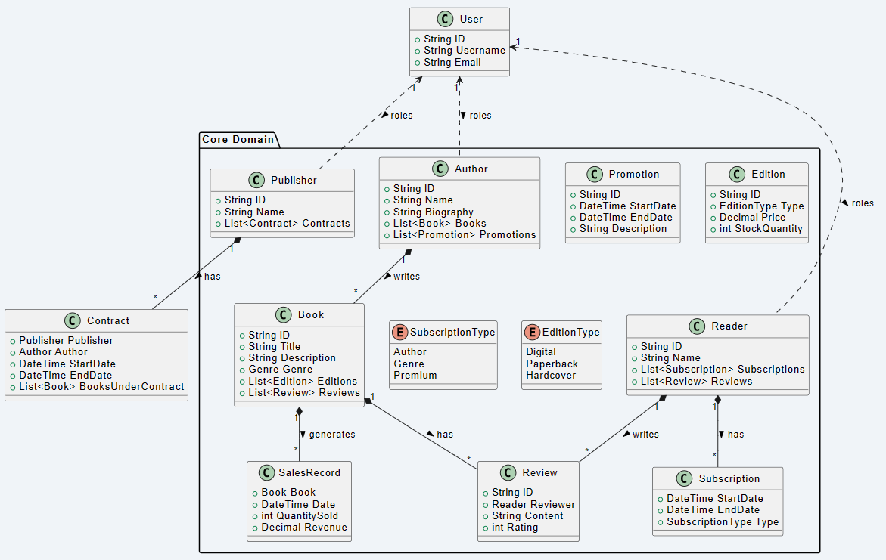
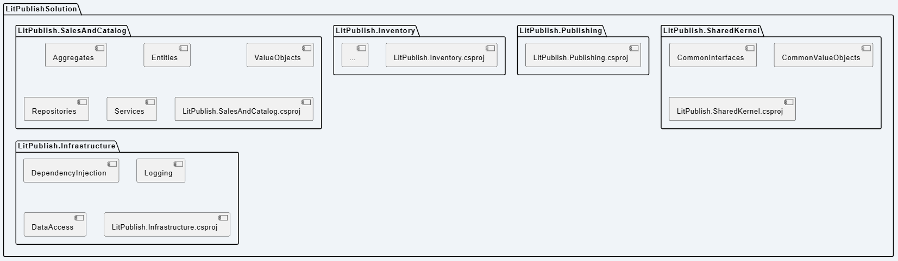
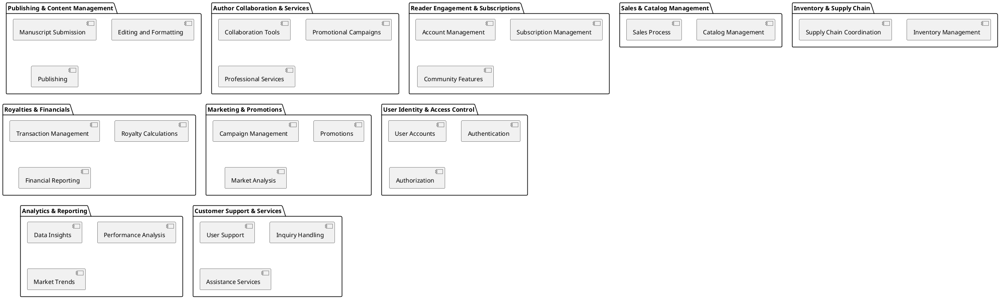
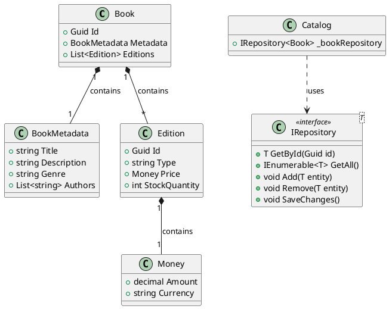
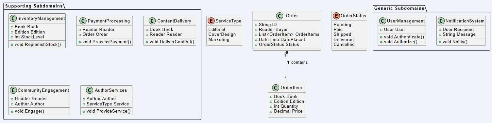

# LitPublish: Domain-Driven Design Sample Project

LitPublish is a sample C# project illustrating the application of Domain-Driven Design (DDD) principles to a fictitious online publishing platform. The platform enables authors to self-publish, manage digital and print editions, track sales, and interact with readers. It also provides a marketplace for readers to purchase books and subscribe to authors or genres.

## Bounded Contexts

This project is organized into several Bounded Contexts, each representing a distinct area of functionality within the domain model:

- Sales & Catalog Management: This context is responsible for managing the catalog of books, including book details, pricing, and availability. It also handles the sales process, from browsing and searching for books to placing orders.

- Inventory & Supply Chain: Manages the physical stock of books, tracks inventory levels, oversees print runs for physical books, and coordinates with distribution channels to fulfill orders.

- Publishing & Content Management: Focuses on the process of book creation, from manuscript submission to editing, formatting, and publishing both digital and physical editions of books.

- Author Collaboration & Services: Provides a suite of services to authors, including collaboration tools, promotional campaign management, and access to professional services like editing and cover design.

- Reader Engagement & Subscriptions: Handles reader accounts, including subscription management, reading preferences, and community features like reviews, forums, and personalized recommendations.

- Royalties & Financials: Manages financial transactions, author royalty calculations and payments, and provides reporting and analytics on financial aspects of the platform.

- Marketing & Promotions: Focuses on creating and managing marketing campaigns, promotions for books and authors, and analyzing the effectiveness of marketing efforts.

- User Identity & Access Control: Manages user accounts, authentication, authorization, and role management across the platform for readers, authors, and publishers.

- Analytics & Reporting: Provides insights and data analysis for various stakeholders, including book sales performance, market trends, and user engagement metrics.

- Customer Support & Services: Offers support services to users of the platform, handling inquiries, complaints, and providing assistance with platform features.

### Sample Domain Description for LitPublish

Core Domain:

Book: A central aggregate root in our domain, a book has a unique identifier, metadata (title, description, genre), pricing details, and is associated with one or more authors. Books can have multiple editions (e.g., digital, paperback, hardcover) and can be available or unavailable.

Author: An aggregate root representing an individual who can write and publish books through the platform. Authors have profiles, a catalog of their published works, and can interact with readers and track sales.

Publisher: Represents a publishing entity that can collaborate with authors to publish books. Publishers have contracts with authors and manage financials and marketing for published books.

Reader: An entity representing a user of the platform who can buy books, subscribe to authors or genres, and leave reviews.

Subscription: A value object representing a reader's subscription to a book, author, or genre, providing access to exclusive content or notifications.

SalesRecord: An entity tracking the sales of books, including quantities sold, revenue generated, and timeframes.

Promotion: An entity representing marketing campaigns for books or authors, which can be targeted based on reader preferences and behaviors.

Review: A value object associated with a book, containing reader feedback, ratings, and comments.

Analytics: A domain service that provides insights into sales trends, reader engagement, and the effectiveness of promotions.

Supporting Subdomains:

Inventory Management: A subdomain focused on tracking the stock levels of physical books, managing print runs, and handling distribution logistics.

Payment Processing: Handling transactions for book sales, author royalties, and reader subscriptions.

Content Delivery: Managing the distribution of digital content to readers and ensuring secure access to purchased materials.

Community Engagement: Features that facilitate interaction between readers and authors, such as forums, live Q&A sessions, and personalized recommendations.

Author Services: A suite of services offered to authors, including editorial services, cover design, and marketing support.

Generic Subdomains:

User Management: Handling user accounts, authentication, and authorization for readers, authors, and publishers.

Notification System: Sending out alerts, reminders, and marketing communications to users.

## Project Structure

The project is structured as follows:

LitPublishSolution/
├── LitPublish.SalesAndCatalog/
│ ├── Aggregates/
│ ├── Entities/
│ ├── ValueObjects/
│ ├── Repositories/
│ ├── Services/
│ └── LitPublish.SalesAndCatalog.csproj
├── LitPublish.Inventory/
│ └── (similar structure)
├── LitPublish.Publishing/
│ └── (similar structure)
├── LitPublish.SharedKernel/
│ ├── CommonInterfaces/
│ ├── CommonValueObjects/
│ └── LitPublish.SharedKernel.csproj
├── LitPublish.Infrastructure/
│ ├── DependencyInjection/
│ ├── Logging/
│ ├── DataAccess/
│ └── LitPublish.Infrastructure.csproj
└── (Additional projects here)

Each Bounded Context is encapsulated in its own project, promoting a clear separation of concerns and aligning with DDD principles.
